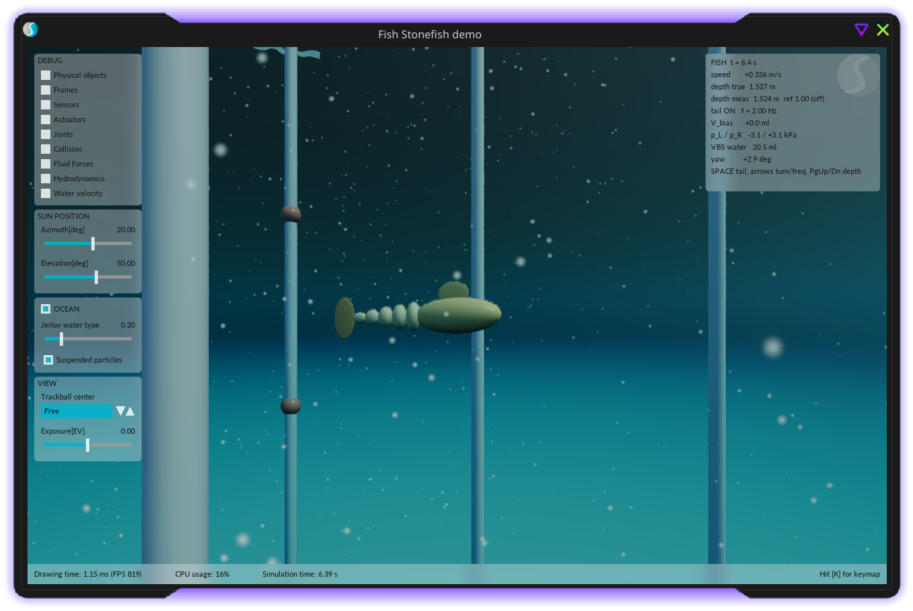

# Stonefish demo – robot fish with a segmented tail, ballast and sensors

An educational simulation of a robot fish in the [Stonefish](https://github.com/patrykcieslak/stonefish) library (C++, University of Girona).
Specification: [SPEC_fish_stonefish_demo.md](SPEC_fish_stonefish_demo.md) (in Polish). The same robot and the same hydraulics as in the MuJoCo demo ([../MuJoCo](../MuJoCo/README.md)), so that both simulators can be compared. The SPEC asks for Polish comments; at the user's request, code comments and documentation have been translated from the original Polish into English.

> **This is not a calibrated model.** Every physical parameter in [config/default.json](config/default.json) is marked `PLACEHOLDER – to be identified from measurements`. The numbers in the plots show *mechanisms*, not the performance of a specific robot.



**Key findings** (details below):

1. Stonefish hydrodynamics "from geometry" alone **produces no thrust** for a flapping tail (0.3 cm/s). The force on each face acts along the relative water velocity (pure drag, no lift), and the default friction is ~250× too large for such a small object. After adding fin lift (custom model, [src/FinLift.cpp](src/FinLift.cpp)) and friction from boundary layer theory, the fish swims at 34 cm/s.
2. Stonefish 1.5 has several undocumented pitfalls that corrupt results without any message: wrongly computed velocities in a branched link tree, compound bodies without added moment of inertia, ocean currents disabled by default, gravity overwritten after the constructor, and a servo without a working torque mode. The list with symptoms is in the [Stonefish 1.5 pitfalls](#stonefish-15-pitfalls) section.
3. The depth controller works on a **noisy pressure sensor** through a low-pass filter. The MuJoCo gains produced a limit cycle here, while gains derived from a model of the vertical motion work (3 cm overshoot).

---

## Table of contents

- [Versions](#versions)
- [Step-by-step installation](#step-by-step-installation)
- [Running](#running)
- [Project structure and where the parameters are](#project-structure-and-where-the-parameters-are)
- [Robot model](#robot-model)
- [How Stonefish computes water forces from geometry](#how-stonefish-computes-water-forces-from-geometry)
- [Thrust diagnosis – why the fish did not swim at first](#thrust-diagnosis--why-the-fish-did-not-swim-at-first)
- [Hydraulics and control](#hydraulics-and-control)
- [What each plot shows](#what-each-plot-shows)
- [Tests](#tests)
- [Stonefish 1.5 pitfalls](#stonefish-15-pitfalls)
- [Limitations](#limitations)
- [Comparison with the MuJoCo demo](#comparison-with-the-mujoco-demo)
- [ROS 2 (stage 7)](#ros-2-stage-7)

---

## Versions

| Component | Version |
|---|---|
| Stonefish | **1.5.0** (tag `v1.5`, commit `7d52673`, June 2025). The documentation of this version is the `docs/` directory in the repository at that tag (= stonefish.readthedocs.io, version 1.5). The `master` branch is already 1.6-dev with different thread handling – not used. |
| System | Fedora 44, Linux 7.2, KDE (Wayland) |
| Compiler | GCC 16.2.1, CMake 4.3.0, C++20 |
| GPU | AMD Radeon RX 7700 XT, Mesa 26.2.3 (radeonsi), OpenGL 4.6 Core |
| Python (tools) | 3.14, packages in [requirements.txt](requirements.txt) |
| JSON (C++) | nlohmann/json 3.11.3 (single header in `third_party/`, MIT license) |
| ROS 2 | not installed – see [ROS 2](#ros-2-stage-7) |

## Step-by-step installation

### 1. Stonefish dependencies

Stonefish requires: OpenGL ≥ 4.3 (GPU driver), SDL2, Freetype, GLM (≥ 0.9.9) and OpenMP (included in GCC).

```bash
# Fedora
sudo dnf install cmake gcc-c++ SDL2-devel freetype-devel glm-devel mesa-libGL-devel
# Ubuntu
sudo apt install cmake g++ libsdl2-dev libfreetype-dev libglm-dev libgl-dev
glxinfo -B | grep "core profile version"     # should be ≥ 4.3
```

<details><summary>Without administrator rights (as done on the demo author's computer)</summary>

The `-devel` packages can be unpacked into the home directory without installation – the runtime libraries (`SDL2`, `freetype`) are usually already on the system:

```bash
mkdir -p ~/rpms && cd ~/rpms && dnf download SDL2-devel freetype-devel glm-devel
mkdir -p ~/.local/opt/sfdeps && cd ~/.local/opt/sfdeps
for r in ~/rpms/*x86_64.rpm ~/rpms/*noarch.rpm; do rpm2cpio $r | cpio -idm; done
# .so symlinks point to the system files:
ln -sf /usr/lib64/libfreetype.so.6 usr/lib64/libfreetype.so
ln -sf /usr/lib64/libSDL2-2.0.so.0 usr/lib64/libSDL2-2.0.so
```
The file `usr/lib64/cmake/SDL2/SDL2Config.cmake` from the `sdl2-compat-devel` package has hardcoded `/usr` paths – it has to be replaced with a short file setting `SDL2_INCLUDE_DIRS` and `SDL2_LIBRARIES` to the unpacked directory. Then `-DCMAKE_PREFIX_PATH=$HOME/.local/opt/sfdeps/usr` is added to every `cmake` call.
</details>

### 2. Stonefish 1.5 library from source

```bash
git clone https://github.com/patrykcieslak/stonefish.git ~/src/stonefish
cd ~/src/stonefish && git checkout v1.5
cmake -S . -B build -DCMAKE_INSTALL_PREFIX=$HOME/.local/opt/stonefish
cmake --build build -j$(nproc) && cmake --install build
```
Installation into the home directory (no `sudo`). System-wide: omit `CMAKE_INSTALL_PREFIX` and use `sudo cmake --install build`.

SPEC stage 1 (example from the repository): `cmake -S . -B build-tests -DBUILD_TESTS=ON && cmake --build build-tests`, then `build-tests/Tests/UnderwaterTest` (window with the GIRONA500 robot) and `build-tests/Tests/ConsoleTest` (no window). Both work.

### 3. This demo

```bash
cd Stonefish/
cmake -S . -B build -DCMAKE_PREFIX_PATH=$HOME/.local/opt/stonefish   # (+ ;$HOME/.local/opt/sfdeps/usr without sudo)
cmake --build build -j$(nproc)          # builds without warnings (-Wall -Wextra)
python3 -m venv .venv && .venv/bin/pip install -r requirements.txt
```
The meshes and XML scenarios are in the repository. The generator is needed only after changing the geometry: `.venv/bin/python tools/make_meshes.py`.

## Running

### Graphical application (real-time preview)

```bash
build/fish_gui config/s2_swim.json              # any config/*.json file
build/fish_gui config/s1_hover.json --out /tmp/log.csv   # optionally with a log
```

**Window size.** Stonefish 1.5 does not support window resizing: the rendering buffers have a size fixed at startup, so after stretching or maximizing the image stays at the old size or gets distorted. That is why the window has a size chosen at startup, by default 90% of the primary screen, and is locked against resizing. A different size: `build/fish_gui config/s2_swim.json --window 1600x900`. On Wayland SDL reports the physical resolution, while the compositor computes the window size in logical pixels, so the program divides the size by the display scale (from DPI). With fractional scaling (e.g. 125%) the image is still slightly blurry: the library creates the window without `SDL_WINDOW_ALLOW_HIGHDPI` and the compositor scales it. Running on a monitor with 100% scale gives a sharper image.

| Key | Action |
|---|---|
| Space | start/stop the tail (CPG) |
| ← / → | turn: V_bias −/+ 0.5 ml (max ±4 ml), disables the heading controller |
| ↑ / ↓ | tail frequency ±0.25 Hz, without a phase jump |
| PgUp / PgDn | depth setpoint −/+ 0.25 m (shallower/deeper), enables the depth controller |
| W S A D Q Z, mouse | camera (library keys); the camera is attached to the fish head |
| H / C / K / Esc | panel / message console / key list / exit |

The overlay in the top right corner (time, speed, true and sensor depth, f, V_bias, p_L/p_R, water in VBS, heading) is in English and ASCII, because the interface font does not have to contain non-ASCII (e.g. Polish) characters.

**Screenshots:** the library has no such function. In KDE: `spectacle -b -n -a -o file.png` (active window), in GNOME: `gnome-screenshot -w`. That is how `results/gui_s2_swim.png` was made.

**Warnings at startup** `[ERROR] Failed to compile shader: hbaoBlur.frag, hbaoBlur2.frag, thermalVisualize.frag, sonarVisualize.frag` appear on the Mesa driver in the library examples too. They concern the ambient occlusion effect (HBAO) and the thermal and sonar cameras, which the demo does not use. Rendering works (~800 FPS on RX 7700 XT).

### Console application (no window – batch scenarios, tests)

```bash
build/fish_console config/s2_swim.json                       # log -> results/logs/s2_swim.csv
build/fish_console config/s2_swim.json --out /tmp/a.csv --duration 30
build/fish_console config/s3_turn.json --set rhythm.volume_bias=-2e-6 --set rhythm.freq=1.5
.venv/bin/python tools/run_scenarios.py -j 8     # all scenarios + frequency sweep + plots (~1 min)
tests/run_tests.sh                                # tests (~20 s)
```

The library distinguishes the two modes by the application class: `sf::GraphicalSimulationApp` (OpenGL window, physics step matched to the clock) and `sf::ConsoleSimulationApp` (no rendering). In the console we call `Run(true, true, 1/sps)`, i.e. a fixed step computed as fast as the processor allows: 5–8× faster than real time. Console mode has no cameras, lights or waves, so the scenarios do not use them.

### Changing parameters without recompilation

- **Numbers** (hydraulics, control, stiffnesses, friction, lift, time step): edit [config/default.json](config/default.json) or the scenario file `config/sN_*.json` (it overrides only selected fields, *JSON merge-patch* merging), or use `--set section.key=value`.
- **Geometry, materials, sensors, joints, VBS** (what goes into the XML): change `config/default.json`, run `tools/make_meshes.py`. The generator recomputes the ballast mass and position (neutral buoyancy + trim) and fills in the templates.
- **XML scenarios** (start position, current, environment): templates in [tools/templates/](tools/templates/), generated files in [data/scenarios/](data/scenarios/). The templates are needed because **Stonefish allows materials to be defined only in the main scenario file**, and the densities come from the configuration.

## Project structure and where the parameters are

```
Stonefish/
  config/default.json        # ALL parameters with descriptions (JSON with // comments)
  config/s*.json, t_*.json    # scenarios: only the differences from default.json
  data/meshes/               # *_phy.obj (for physics, 320 triangles/ellipsoid), *_vis.obj (smooth), vbs_*.obj
  data/scenarios/            # fish_base.scn (robot), world_base.scn (seabed, posts), s1…s5, t_internal (GENERATED)
  tools/templates/*.scn.in   # XML templates with comments – change the scenario structure here
  tools/make_meshes.py       # meshes + mass balance + ballast + XML
  tools/run_scenarios.py     # all console runs -> results/logs/ -> plots
  tools/plot_logs.py         # CSV -> PNG + plot data (CSV) + results/summary.json
  src/FishSimManager.*       # loads the scenario, control loop, CSV log
  src/Hydraulics.*           # first-order pump + L/R chambers + relief valve (ODE)
  src/TailDriver.*           # hydraulic force -> joint torques + silicone elasticity
  src/FinLift.*              # fin lift (missing in Stonefish)
  src/Controllers.*          # CPG, filter, depth PID (VBS), heading PI
  src/Config.*, AppArgs.h    # JSON loading, command line
  src/main_gui.cpp, main_console.cpp
  tests/run_tests.sh, unit_tests.cpp, check_logs.py
  results/                   # PNG plots + CSV (full logs in results/logs/ – not in git)
```

## Robot model

| Element | Implementation in Stonefish | Values (PLACEHOLDER) |
|---|---|---|
| Head | `base_link` of type `model`: hull mesh (ellipsoid 25×10×10 cm) merged with the dorsal fin; `physics="submerged"` (buoyancy + drag + added mass) | mass 1225 g, center of mass 8.9 mm below the axis |
| Ballast | included in the head's `<mass>`, `<inertia>`, `<cg>` (steel 453 g, 9.7×3.5×1.7 cm at the bottom), computed from the buoyancy and trim conditions | – |
| Tail | 5 silicone `model` links (1100 kg/m³), `revolute` joints about the Z axis, ±35°, `<damping>` 0.005 N·m·s/rad | 4 cm segments, tapering to 40% |
| Caudal fin | separate link, `fixed` joint with the last segment; thin in Y (6 mm), tall in Z (12 cm) | S = 66 cm² |
| Silicone elasticity | **absent in Stonefish** -> C++: torque −k·θ through a `motor` actuator | actuated 0.3 N·m/rad; passive computed from a 3 Hz resonance: 1.01 and 0.42 N·m/rad |
| Hydraulic drive | `motor` actuator in each joint, torque from C++ ("Hydraulics" section) | as in MuJoCo |
| VBS | `vbs` actuator on the head, "empty" 0.5 ml / "full" 40.5 ml meshes, flow rate from C++ (`setFlowRate`) | pump 10 ml/s |
| Sensors | `pressure` (50 Hz, σ = 50 Pa ≈ 5 mm), `imu` (100 Hz, angle noise 0.005–0.01 rad), `encoder` ×5 | – |
| Environment | ocean (water 1000 kg/m³, no waves), seabed at 4 m, posts every 1 m, rocks; in s5 a uniform current of 5 cm/s in +Y | – |

**Mass balance** (`make_meshes.py`, and the same computed by Stonefish at startup – compare with the `Mass budget` block printed in the console): dry fish mass 1567 g, volume 1588 ml. Without water in the VBS the fish is **slightly positively buoyant (+0.20 N)**, with the VBS half full (20.5 ml) neutral (0.000 N), when full −0.20 N. The center of mass is 7.2 mm below the center of buoyancy, and along the X axis it lies exactly below it (trim).

**NED coordinate frame** (Stonefish): X forward, Y to the right, **Z down**, i.e. depth = +z. The meshes are exported already in this frame, and the origin of each link's frame lies on its joint.

**Why this time step (0.5 ms, 2000 Hz).** At 2 ms (the MuJoCo step) the explicitly computed −k·θ springs made the simulation explode within a fraction of a second (θ = −30 rad). Light, short segments (Seg4: 36 g, I_zz ≈ 6·10⁻⁶ kg·m²) between two springs have natural vibrations with ω·dt > 2, and the explicit scheme is stable only for ω·dt < 2. At 1000 Hz everything is stable, 2000 Hz gives a ×2 margin. The swimming speed at 4000 Hz is the same (34.08 cm/s), so the result does not depend on the step.

## How Stonefish computes water forces from geometry

According to the documentation ([docs/theory.rst](https://github.com/patrykcieslak/stonefish/blob/v1.5/docs/theory.rst)) and the author's paper (P. Cieślak, *Stonefish: An Advanced Open-Source Simulation Tool Designed for Marine Robotics, With a ROS Interface*, OCEANS 2019 Marseille), hydrodynamic forces are computed **for each triangle of the physical mesh separately**:

- **Buoyancy** – the sum of hydrostatic pressure forces on the faces. When fully submerged this is ρ·g·V of the mesh volume at the center of buoyancy. It also works with partial submersion and on waves.
- **Drag** – quote from the documentation: *"The drag forces are calculated as a sum of forces acting on each face of the body surface. […] the computations implemented in the Stonefish library have to be based on the local velocity of fluid as if there was no body. The result is not quantitatively correct but it gives a good approximation and allows for effects not possible when using simple formulas, e.g., a water current acting on a part of the body."* In the code (`SolidEntity::ComputeHydrodynamicForcesSubmerged`) a face onto which water "flows" gets a force ∝ |v|·v·(v·n)·A, i.e. **along the relative velocity** v, scaled by the projected face area. On top of that there is linear friction ∝ v_t·A (tangential component). The coefficients are estimated automatically from an equivalent ellipsoid or given in `<hydrodynamics>`.
- **Added mass** – computed from an ellipsoid/cylinder/sphere fitted to the mesh, separately for the three axes. However, only the **mean of the three axes** reaches the physics engine (Bullet) (documentation: "a mean value is used for all of the axes"), together with three added moments of inertia.
- **Lift** – only in the `rudder` actuator (control surface), not for ordinary bodies.

**Difference from MuJoCo.** MuJoCo replaces each body with an ellipsoid and computes forces from a few symbolic coefficients (`fluidcoef`: blunt and slender drag, angular drag, Kutta force, Magnus force). This model **has lift** (Kutta), but knows nothing about the shape beyond the ellipsoid semi-axes and does not know currents acting on only part of a body. Stonefish sees the actual mesh: a current can act on the tail alone, and buoyancy is correct at the surface and on waves. However, it has no lift, and its drag is directionally "isotropic" (always along the velocity). For tail swimming this is crucial – see the next section.

## Thrust diagnosis – why the fish did not swim at first

SPEC §1.7: *"If the fish does not swim forward, do not mask it with blind tuning. Diagnose it."* The first version (everything library defaults) swam at **0.3 cm/s**. Step-by-step diagnosis:

1. **Fin orientation** – correct: thin in Y, tall in Z. Stonefish computed an added mass of 528 g in the Y axis and 11 g in the X axis for it, i.e. it "sees" a flat plate set sideways.
2. **Body physics type** – `submerged` (buoyancy + drag + added mass). `floating` has no added mass, `surface` has no water forces.
3. **Meshes** – closed, normals pointing outward: the volumes computed by Stonefish agree with `trimesh` to within 0.1 ml.
4. **Force model** – this is the cause. Force balance in steady motion (log `Fdrag_*`, `Fskin_all`, `fin_thrust` – projections onto the fish axis, averaged):

| Variant (CPG 2 Hz, 15 s) | Speed | What follows |
|---|---|---|
| Stonefish default (no lift, library friction) | **0.3 cm/s** | drag "along the velocity" has no forward component for a fin moving sideways |
| + fin lift | 1.5 cm/s | thrust of 0.097 N is eaten up by **friction of 0.075 N** at a speed of 1.7 cm/s |
| Blasius friction, no lift | 2.7 cm/s | some "rowing" thrust (fin drag) – too little |
| **Blasius friction + lift (default)** | **34.0 cm/s** | thrust 0.51 N = pressure drag of the head 0.11 + segments 0.30 + fin 0.10 + friction 0.015 N |
| locked tail | 0.0 cm/s | the thrust comes solely from the tail motion |

Two corrections, both from physics and both switchable in the configuration:

- **Friction** (`hydro.skin_friction`). Stonefish computes friction linearly, F = ρ·c·Σ A·v_t, and by default assumes c = 0.1·C_d ≈ 0.1 m/s. For a 0.5 m fish at 0.2 m/s the laminar boundary layer (Blasius: C_f = 1.328/√Re, Re = 10⁵) gives ½ρ·C_f·U² ≈ ρ·c·U with **c = ½·C_f·U_ref = 4.2·10⁻⁴ m/s**, i.e. ~250× less. We set this via `SetHydrodynamicCoefficients` – the equivalent of the `<hydrodynamics viscous_drag>` attribute from the documentation. Pressure drag stays as estimated by the library.
- **Fin lift** (`fin_lift`, [src/FinLift.cpp](src/FinLift.cpp)). Quasi-static flat plate model: C_L = ½·C_Lα·sin 2α (shape as in measurements of flapping plates, Dickinson et al., *Science* 1999). It acts perpendicular to the inflow at the fin center point, C_Lα = 2.8/rad (Helmbold formula for aspect ratio 2.2). Fin drag is still computed by Stonefish from the mesh, so nothing is counted twice. First I tried the built-in `rudder` actuator. Its lift grows linearly with α up to the stall angle and then vanishes. A flapping fin at startup (α ≈ 90°) is therefore "stalled": with 35° it gave 1.7 cm/s, with 89° 5.7 cm/s, and at 90° (plate broadside to the flow) the lift would even be the largest, which is unphysical.

The result does not depend on the numerics: 4000 Hz gives 34.08 cm/s, hydrodynamics computed every 40 steps (the library default of 50 Hz) gives 34.05 cm/s.

## Hydraulics and control

**Hydraulics** ([src/Hydraulics.cpp](src/Hydraulics.cpp)) – 1:1 model as in MuJoCo: the pump as a first-order element (u ∈ [−1,1], Q_max = 60 ml/s, τ = 30 ms), closed L↔R chamber system (V_L + V_R = const), compliance Δp = (V_p − A_eff·r_eff·L)/C_h with a ±50 kPa relief valve. The force on the "tendon" is F = A_eff·r_eff·Δp, and in the joints τ_i = w_i·F (weights 1, 0.7, 0.4 for the three actuated ones, 0 for the passive ones) plus elasticity −k_i·θ_i.

**How torques reach the joints (the key unknown from SPEC §1.4).** The servo (`servo`) in v1.5 has a `ServoControlMode::TORQUE` mode in its header, but `Servo::Update` handles it the same as velocity mode, so **there is de facto no torque mode**. The **`motor`** actuator is used: it is in the v1.5 XML parser, although it is not in the documentation. It calls `FeatherstoneEntity::DriveJoint` → `btMultiBody::addJointTorque`, i.e. a generalized joint force. In the Featherstone algorithm it acts on the child (+τ) and the parent (−τ) simultaneously, so **the drive is internal**. This is checked by the `t_internal` test: without water and gravity, with the tail flapping and the head nodding ±7.6°, the center of mass moves by 0.085 mm in 3 s, and the angular momentum L_z ≤ 4.5·10⁻⁶ kg·m²/s. A torque set in `SimulationStepCompleted` takes effect in the next step (actuators are updated at the start of the step), i.e. the coupling is explicit, as in MuJoCo.

**CPG** ([src/Controllers.cpp](src/Controllers.cpp)) sets the **volume**, not the flow: V_ref = A_V·sin(2πft) + V_bias, u = (dV_ref/dt + K_v·(V_ref − V_p))/Q_max. The SPEC proposes u = A·sin + bias, but volume is the integral of flow. A constant bias in u would integrate without end (the tail would press against the valve), and a pure sine gives ∫sin = 1 − cos ≥ 0, i.e. an offset to one side. This is the same correction as in the MuJoCo demo.

**Depth controller** (scenario 4). The input is the **pressure sensor reading** (gauge, 50 Hz, noise σ ≈ 5 mm of water) converted to depth d = p/(ρg), not the true position from the simulator. Then:

- **First-order 1 Hz low-pass filter.** The D term differentiates the measurement: the difference of two noisy samples 20 ms apart gives a velocity noise of ~√2·5 mm/0.02 s ≈ 0.35 m/s, larger than the fish speed. The filter attenuates the noise ~4× (unit test), but delays the measurement by ~0.16 s. The plot shows a "filter − truth" error of up to 3 cm during fast descent.
- **PID → water volume setpoint V_ref** (more water = heavier). The VBS pump tracks V_ref with a limited flow rate of 10 ml/s. The D term acts on the filtered velocity (no "kick" on a setpoint step).
- **Gains from the model, not from MuJoCo.** With the MuJoCo gains (kp = 200 ml/m) the controller fell into a ±10–40 cm limit cycle: the output jumped between "empty" and "full", and the pump needs 4 s for a full stroke. The vertical motion is m·z̈ = −ρg·ΔV, where m ≈ 2.6 kg (fish + water in VBS + added mass). For ω_n = 0.3 rad/s and ζ ≈ 1 this gives kp = ω_n²m/(ρg) ≈ 24 ml/m and kd = 2ζω_n·m/(ρg) ≈ 160 ml/(m/s). The "pump keeps up" condition: kp·A·ω < q_max.
- **Conditional integration** (only when |e| < 0.2 m) plus the usual anti-windup on saturation. For a 2 m step the output is *not* saturated during most of the travel, so the usual anti-windup does not help, and the integral accumulates ∫e for 20 s. With it the overshoot was 24 cm, without it 3 cm.

**Heading controller** (scenario 5): PI on the IMU yaw → V_bias. The sign was checked in scenario 3: V_bias > 0 bends the tail to the left (−Y) and the fish turns left.

## What each plot shows

Everything is generated by `tools/run_scenarios.py`. Next to each PNG there is a CSV with the plotted data, and the numbers are in `results/summary.json`.

| Plot | What it shows |
|---|---|
| [s1_hover_drift.png](results/s1_hover_drift.png) | Unpowered hover, VBS at mid-range. The true depth changes by **0.05 mm in 5 s** and 0.2 mm in 10 s, horizontal drift 0 – the buoyancy/weight balance computed by the generator matches what Stonefish computes. The gray band is the pressure sensor reading (±1 cm noise). |
| [s1_righting.png](results/s1_righting.png) | Start with a 30° roll. The righting moment (center of mass 7.2 mm below the center of buoyancy) acts immediately: rocking about the upright with a period of 0.63 s, consistent with the metacentric height. Damping is **weak**: 30° → 10° after 5 s → 6° after 18 s. A smooth ellipsoid rotating about its axis offers almost no resistance, and Stonefish assumes a zero added moment of inertia about X. The dorsal fin (part of the head mesh) improved this from 16° to 10° after 5 s. In MuJoCo (`C_angular` model) the fish returns upright in 0.3 s. |
| [s2_speed_vs_locked.png](results/s2_speed_vs_locked.png) | Left panel: speed (averaged over the flapping period) for the five variants from the table in "Thrust diagnosis": locked tail 0, Stonefish alone 0.3 cm/s, default model **34 cm/s** after ~6 s. Right panel: force balance in steady motion – the largest drag comes from the tail segments (faces flapping sideways also "row" backward). |
| [s3_trajectory.png](results/s3_trajectory.png) | XY trajectories over 30 s for V_bias = −3…+3 ml. Tail bent to the left → left turn, and the radius decreases with bias: **20.4 / 10.1 / 6.6 m** for 1 / 2 / 3 ml, symmetric in both directions. The speed hardly changes. The first version clipped the posts and had asymmetric radii, which is why the start is at x = −8 m. |
| [s4_depth_true_vs_measured.png](results/s4_depth_true_vs_measured.png) | Depth steps 1 → 3 → 2 m. Top panel: setpoint, true, measured and filtered measurement. Middle: measurement error (sensor ±1 cm noise, filter up to 3 cm lag during descent). Bottom: water in VBS and V_ref. Overshoot **3.3 cm**, entering the ±5 cm band after **21 s** (2 m down) and **16 s** (1 m up), steady-state error 0.2 cm. Water in the VBS stays within 1.8–39 ml (range 0.5–40.5 ml), and V_ref hits the limit only at the start of each step. |
| [s5_current_drift.png](results/s5_current_drift.png) | Lateral current 5 cm/s in +Y, swimming at 2 Hz, 30 s. **Without the controller** the fish weathervanes into the current (heading −15°): the tail has a larger lateral area than the head. It then swims slightly against the current (−1.0 m in Y). **With the heading controller** it holds a heading of ~+3° and is carried along with the current (+1.0 m in Y). Lesson: holding a *heading* is not holding a *track* – that requires a position measurement (DVL, GPS at the surface, vision). |
| [s6_freq_sweep.png](results/s6_freq_sweep.png) | Sweep over 0.5–3 Hz at the same commanded amplitude (A_V = 8 ml), 60 s per point. Above **Q_max/(2π·A_V) = 1.19 Hz** the pump saturates (right panel: 45–80% of the time |u| = 1), so the tail amplitude drops (middle). The speed is highest at **1.75–2.25 Hz (33–34 cm/s)**. Curiosity: at 0.75, 2.75 and 3 Hz the fish **starts backward** (−12…−13 cm/s), then **turns around** (heading change ~200°) and swims forward. A flat plate is symmetric front–back, so lift can push in either direction. The direction depends on the phase of the fin pitch relative to its lateral motion, and that depends on the frequency relative to the tail resonances (a symmetric flapping plate can spontaneously swim in either direction: Vandenberghe, Childress, Zhang, *J. Fluid Mech.* 2004). Backward motion is directionally unstable (like a weathervane turned backward), hence the turning around. |
| [gui_s2_swim.png](results/gui_s2_swim.png) | Screenshot from the graphical application (scenario 2, t = 6.4 s, 0.336 m/s). |

## Tests

`tests/run_tests.sh` (≈20 s) runs:

1. **Unit tests** (`build/unit_tests`, no simulator): V_L + V_R = const and |p_L − p_R| ≤ p_max under random pump operation (the valve actually opens); the sum of TailDriver torques on all bodies = 0; weights and the formula τ = w·F − k·θ; direction and magnitude of the FinLift lift (thrust for lateral motion in both directions, zero at α = 0° and 90°); the filter attenuates noise; anti-windup; z_min limit; CPG phase continuity when f changes.
2. **Every scenario loads** without parser errors.
3. **Console runs and assertions** ([tests/check_logs.py](tests/check_logs.py)): no NaN; s1: |Δz| after 5 s < 5 mm and horizontal drift < 5 mm; righting: roll after 5 s < ½ of the initial roll; hydraulics in the s2 log: V_L + V_R = const, |Δp| ≤ p_max; internal drive: sum of torques = 0, center of mass stationary (< 1 mm), L_z ≈ 0; s2: moving tail > 5 cm/s, locked ≈ 0; s4: steady-state error < 5 cm, VBS within range.

Result on the author's computer: **ALL TESTS PASSED**. From CMake: `ctest --test-dir build`.

## Stonefish 1.5 pitfalls

Found during the work (verified in the library sources), with a workaround for each:

| Problem | Symptom | Workaround in the demo |
|---|---|---|
| `SolidEntity::getLinearVelocity/getAngularVelocity` for a robot link sums the contributions of **all** links with a lower index, as if the tree were a chain | After adding the dorsal fin as a separate link at the head, all segments after it got wrong velocities, and therefore **wrong water forces** (the library computes them from these velocities) and a wrong angular momentum in the test | The robot is a serial chain, and the dorsal fin is part of the head mesh (union of bodies) |
| `Compound::getAugmentedInertia()` returns the inertia without added mass | The head with ballast as a compound body had no added moment of inertia | Head as a `model` with `<mass>/<inertia>/<cg>` computed by the generator |
| Currents from XML (`<current>`) are added, but `Ocean::currentsEnabled = false`, and nothing in the library calls `EnableCurrents()` | The 5 cm/s current did not work at all (6 cm drift in 30 s) | `getOcean()->EnableCurrents()` after loading the scenario |
| `setGravity()` in the manager constructor gets overwritten (`g = 9.81` in `InitializeSolver`) | The "no gravity" test fell to the seabed | `setGravity` at the start of `BuildScenario()` |
| The servo has no working torque mode | – | `motor` actuator (undocumented, but supported by the parser) |
| VBS: `initial` is a volume in m³, not a fraction (the documentation example has `0.5`); water in the VBS **adds weight** | – | `initial` = 20.5e-6 m³; controller: more water = down |
| Default friction coefficients (c = 0.1 m/s) | A small fish practically does not swim | Blasius friction (`hydro.skin_friction`) |
| Hydrodynamics by default every `sps/50` steps (50 Hz) | Stepped force at 2 Hz flapping (no effect on the result here) | `sim.fluid_prescaler = 1` |
| Materials only in the main scenario file | They cannot be kept in `fish_base.scn` | Scenarios generated from templates |
| Compilation of HBAO/thermal/sonar shaders on Mesa | `[ERROR] Failed to compile shader` at GUI startup | Harmless for this demo |
| The CMake package accepts only an exact version | `find_package(Stonefish 1.5)` does not find 1.5.0 | `find_package(Stonefish)` + own version check |

## Limitations

1. **Rigid-segment tail instead of a soft one.** 5 rigid links with springs in the joints (pseudo-rigid-body model). Stonefish does not simulate soft bodies. The hydraulics controls only the combination L = Σ w·θ, and the tail shape results from inertia, springs and water.
2. **Quasi-static hydrodynamics, no vortex wake.** Forces depend only on the instantaneous face velocity ("as if there was no body"). There are no vortices behind the fin, no delayed stall, no interaction between bodies through the water (the fin does not "feel" water pushed by the hull), and no wall or surface effects. The fin lift is an added, single-point flat plate model, symmetric front–back (hence the backward swimming in s6).
3. **Added mass averaged** over the axes (library/Bullet limitation). The tail is too heavy in the X axis and too light in the Y axis, and the added moment of inertia about the X axis is 0. Hence the weakly damped rocking in s1.
4. **Linear friction**, linearized at U_ref = 0.2 m/s. For other speeds it is an approximation.
5. **Hydraulics as an external model** (C++, explicit coupling, 0.5 ms step): linear compliance, ideal valve, first-order pump, no losses or power.
6. **Unidentified parameters** – all `PLACEHOLDER`. The calibration procedure (bench, tail in water, tethered thrust, pool) is described in the MuJoCo demo README and applies here unchanged. In addition, measurements of the rocking damping and the turning radius are needed.
7. **GPU-dependent performance.** The graphical application requires OpenGL ≥ 4.3 (~800 FPS on RX 7700 XT, Mesa). Without a GPU only the console application works (5–8× faster than real time at 2000 Hz).
8. **No waves or camera in console mode** – a library limitation, so the scenarios do not use them.

## Comparison with the MuJoCo demo

The same robot (geometry, densities, hydraulics, CPG, bladder/VBS range). Differences only where the simulator forces them.

| Quantity | MuJoCo | Stonefish | Source of the difference |
|---|---|---|---|
| Speed at 2 Hz | 22 cm/s | **34 cm/s** | different drag model: MuJoCo computes drag from ellipsoids and `fluidcoef` coefficients, Stonefish from each face; in Stonefish the fin lift comes from an added model |
| Best frequency | 1.5–1.75 Hz (24 cm/s) | 1.75–2.25 Hz (33–34 cm/s) | different added mass → different resonances and phase of the wave along the tail |
| Pump saturation at 2 Hz | 72% | 76% | same hydraulics – consistent |
| Fin amplitude at 2 Hz | 35.7° | 37.4° | consistent |
| Backward swimming | with a wrong wave phase (first version) | at 0.75, 2.75, 3 Hz – then turns around | symmetric plate in both lift models |
| Turning radius, V_bias = 3 ml | 2.0 m | 6.6 m | not investigated in detail; possible causes: averaged added mass of the head (in Stonefish 1.6 kg in all axes), different yaw rotation drag, different tail deflection shape |
| Righting from 30° | ~0.3 s | rocking, 10° after 5 s | MuJoCo has rotational damping (`C_angular`), while Stonefish has zero added moment of inertia about X |
| Depth change of 1 m | ~35 s | ~16 s to ±5 cm | different gains (here derived from the model) and measurement through the sensor |
| Buoyancy | computed by hand in Python | **from the mesh**, by the library | – |
| Current on part of the body | none | yes (s5: weathervane effect) | – |
| Time step | 2 ms | 0.5 ms | explicit joint springs + light segments |

Takeaway for the learner: **neither of these models predicts the speed of the real robot** (22 vs 34 cm/s for the same parameters). Both show the same *mechanisms* – pump saturation, the wave along the tail, turning via bias, the righting moment, depth control – and the numbers have to be calibrated with measurements.

## ROS 2 (stage 7)

Skipped, as the SPEC allows. This computer has no ROS 2, and Fedora is not a Tier 1 platform for ROS 2 (Ubuntu is). The [`stonefish_ros2`](https://github.com/patrykcieslak/stonefish_ros2) package exists and is developed together with the library. On Ubuntu 24.04 + ROS 2 Jazzy, the next steps would look like this:

1. Build Stonefish 1.5 system-wide (`sudo make install`).
2. Clone `stonefish_ros2` into a workspace and run `colcon build`.
3. Use `data/scenarios/fish_base.scn` in a scenario extended with ROS interface definitions for the sensors and actuators (syntax in the `stonefish_ros2` documentation).
4. Move the CPG, hydraulics and PID from `src/Controllers.cpp` to Python nodes.

The hydraulics model and the fin lift are in C++ on the simulator side (`FishSimManager`, `FinLift`), so they would have to be moved into the simulator node or the joint torques exposed as a ROS topic.
