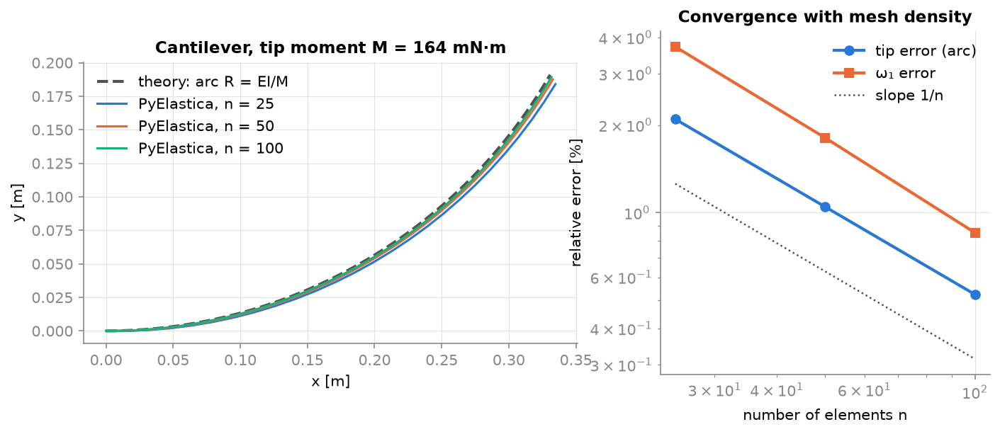
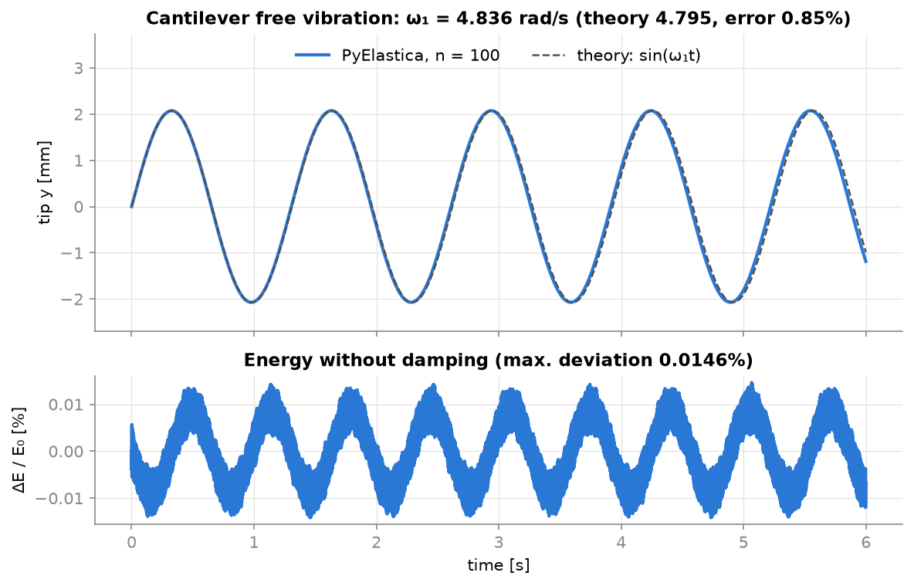
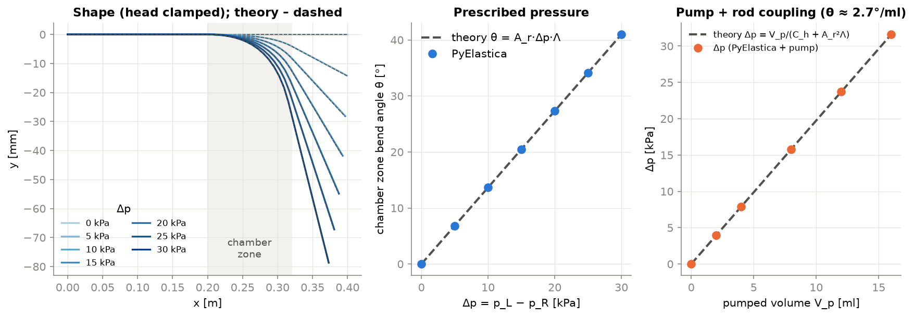
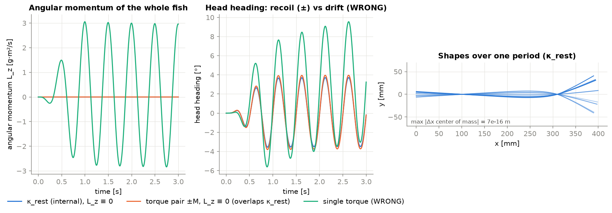
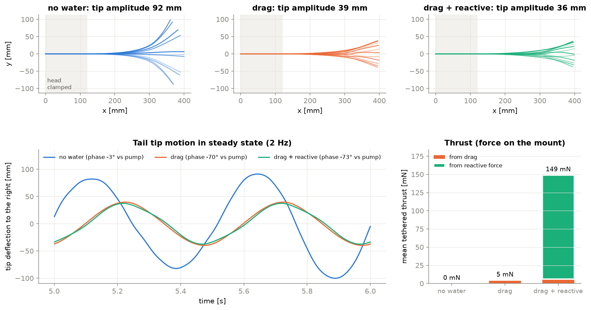
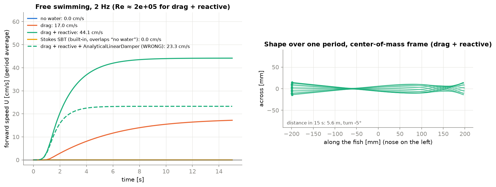
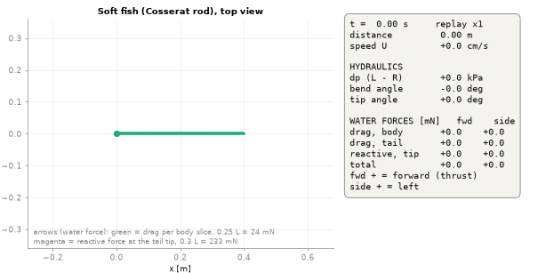
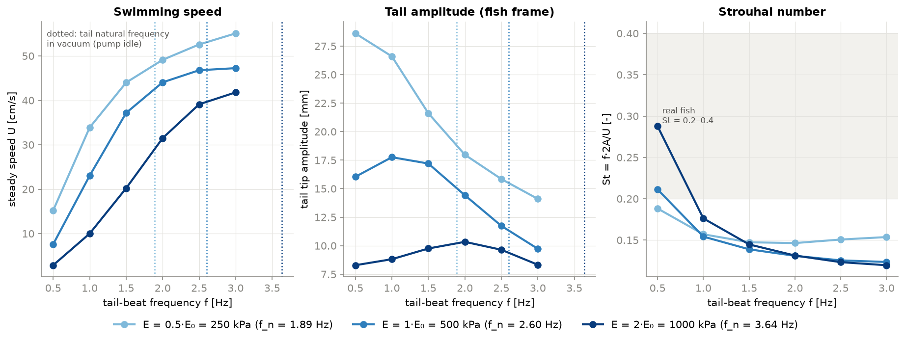
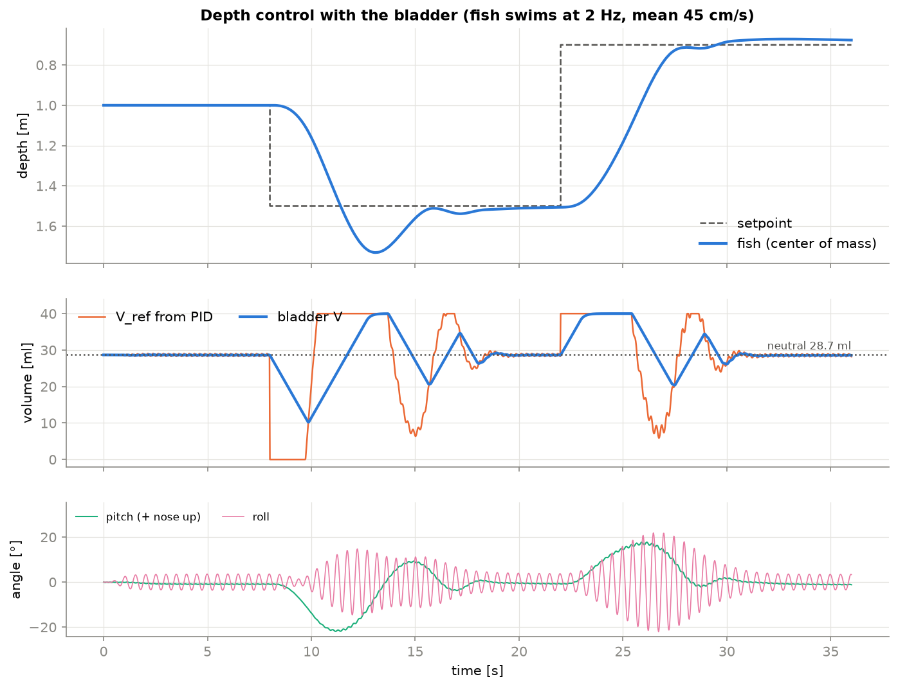

# Soft fish as a Cosserat rod (PyElastica)

A simplified, **educational and uncalibrated** simulation of a soft robotic fish in PyElastica. The whole body and tail are one continuous, soft Cosserat rod (bending, twisting, shear, stretch), driven by internal hydraulic chambers, swimming in a custom high-Reynolds-number water model, with buoyancy, a ballast bladder and a depth controller.

Specification: [`../SPEC_fish_pyelastica_demo.md`](../SPEC_fish_pyelastica_demo.md). **All design parameters are placeholders** (marked `PLACEHOLDER – to be identified from measurements` in [`fishrod/config.py`](fishrod/config.py)). The results are qualitative.

## Progress

| Stage | Scope | Status |
|---|---|---|
| 1 | Rod validation without water: cantilever under end moment, natural frequency, energy conservation | done |
| 2 | Internal actuation via rest curvature, hydraulics ODE, centre of mass / angular momentum check in vacuum | done |
| 3 | Tail in water with the head clamped: `none` / `drag` / `drag+reactive`, tethered thrust | done |
| 4 | Free swimming (planar), water models incl. `stokes_sbt`, damping comparison, animation | done |
| 5 | Sweep: frequency 0.5–3 Hz × Young's modulus ×0.5/×1/×2, resonance, Strouhal number | done |
| 6 | 3D with gravity, buoyancy, ballast bladder and depth PID | done |
| 7 | (optional) Equivalent stiffnesses for the MuJoCo segment model (`results/prbm.json`) | not done |

## Versions

| Package | Version |
|---|---|
| Python | 3.14 |
| PyElastica | **1.0.0** (`import elastica as ea`, mixins from `elastica.modules`) |
| numba / llvmlite | 0.68.0 / 0.50.0 |
| numpy / scipy / matplotlib | 2.5.3 / 1.18.1 / 3.11.2 |
| pytest / pytest-xdist | 9.1.1 / 3.8.0 |

All pinned in [`requirements.txt`](requirements.txt).

## Installation and running

```bash
# from the repository root
python3 -m venv .venv
.venv/bin/pip install --upgrade pip
.venv/bin/pip install -r fish_elastica_demo/requirements.txt

cd fish_elastica_demo
../.venv/bin/python -m pytest                          # 19 tests, ~40 s (6 workers)
../.venv/bin/python scripts/run_scenarios.py           # all stages -> results/*.png, *.csv
../.venv/bin/python scripts/run_scenarios.py --stage 4 # a single stage
../.venv/bin/python scripts/animate.py                 # results/free_swim.gif
```

The first run compiles ~90 numba kernels (~10 s); later runs load them from the cache in `.numba_cache/`.

Runtime on a Ryzen AI 5 PRO 340 (6 cores), all independent runs in parallel:

| Stage | Runs | Wall time |
|---|---|---|
| 1 | 6 (3 resolutions × 2 tests) | ~9 s |
| 2 | 15 | ~14 s |
| 3 | 3 | ~9 s |
| 4 | 5 × 15 s of swimming | ~24 s |
| 5 | 18 × 12 s + 3 | ~70 s |
| 6 | 1 × 36 s (1.9 M steps) | ~50 s |

### Performance settings

[`fishrod/perf.py`](fishrod/perf.py) is imported first by `import fishrod` and sets:

- **One thread per simulation** (`OPENBLAS/OMP/MKL/NUMBA_NUM_THREADS=1`). One time step of a 100-element rod takes ~27 µs, and that time is mostly Python overhead of calling kernels, not arithmetic. Threads inside one rod do not help.
- **Parallelism across processes.** `FISHROD_WORKERS` defaults to the number of physical cores. Measured: 1 process ≈ 38k steps/s; 6 processes ≈ 191k steps/s; 12 processes ≈ 207k steps/s (SMT adds only 8%).
- **Numba cache in the project** (`NUMBA_CACHE_DIR`). Do **not** set `NUMBA_CPU_NAME=host`: llvmlite 0.50 does not recognise that name and silently compiles for a generic CPU.
- Custom forces (water, buoyancy) are single `@njit(cache=True)` kernels called once per step; the integration loop is written by hand (no tqdm), and callbacks / hooks log sparsely.

## What is a Cosserat rod (for a learner)

A **Cosserat rod** is a slender body described by a curve (its centreline, here the fish's spine) **plus a small rigid frame attached to every point of the curve**. The frame has three unit vectors called *directors*: `d3` along the centreline, `d1` and `d2` in the cross-section. Because the frame can rotate independently of the curve, the rod can represent all four kinds of deformation of a slender body:

| Deformation | Strain | Stiffness |
|---|---|---|
| bending about `d1` or `d2` | curvature κ₁, κ₂ | E·I₁, E·I₂ |
| twisting about `d3` | twist κ₃ | G·J |
| shear in `d1` / `d2` | σ₁, σ₂ | α·G·A |
| stretch along `d3` | σ₃ | E·A |

The internal bending moment is `m = B·(κ − κ_rest)`, where `κ_rest` is the **rest curvature**: the shape the rod "wants" to have when unloaded. The equations are 1D (along the length), so a 0.4 m fish with 50 elements has only 51 nodes. Compare that with a 3D finite-element model of the same body, which needs tens of thousands of degrees of freedom. This is a good approximation when the body is much longer than it is thick and its cross-sections stay roughly rigid, which is true for a fish body and tail.

PyElastica discretises the rod into straight elements (positions on nodes, directors on elements, curvatures on the "Voronoi" points between elements) and integrates it with an explicit symplectic scheme (`PositionVerlet`).

## The model

### Rod and cross-section

- **One rod**, 0.4 m long, 50 elements, nose at `x = 0`, tail towards `+X`, so the fish swims towards **−X**. Convention: `d1 = +Z` (up), `d2 = −Y` (sideways).
- **Tapered elliptical cross-section** with semi-axes `a(s)` (half width) and `b(s)` (half height), interpolated from a profile table. PyElastica 1.0 accepts the radius per element, so a single rod is enough and no `FixedJoint` is needed (a joint would act as an extra penalty spring and shorten the stable time step).
- **Flat tail, anisotropic stiffness.** PyElastica assumes a circular section. We pass it the equivalent radius `r = √(a·b)`, which gives the correct area, mass and volume. We then **overwrite the stiffness and rotational-inertia matrices** with ellipse formulas: `I₁ = πa³b/4` (sideways bending), `I₂ = πab³/4` (up-down bending), `J = πa³b³/(a²+b²)`. A laterally flattened tail (`a < b`) is soft sideways and stiff vertically, which is what swimming needs. `cross_section="circle"` switches back to the default circular section.
- **Stiff head**: Young's modulus ×20 for `s < 0.12 m`. Silicone `E = 0.5 MPa`, `ρ = 1050 kg/m³` (placeholders).
- **Mesh choice**: the stiff head at 100 elements would need `dt ≈ 4.8 µs`; 50 elements give `dt ≈ 19 µs` (4× faster). Stage 1 showed that 50 elements are within 1–2% of theory.

### Time step

The integrator is explicit, so `dt < 2/ω_max` of the discrete rod. Two sources of high frequencies (formula in `build.stable_time_step`):

- axial wave: `dt < Δl / c`, `c = √(E/ρ)`;
- shortest bending wave (Euler–Bernoulli, `k = 2/Δl`): `dt < Δl² / (r·c)`. This dominates when `Δl < r`. **dt ∝ Δl²**: halving the element length means 4× smaller steps and 8× longer runs.

In stage 1 the instability appeared between 2× and 3× this estimate, so `dt_safety = 1.0` keeps a ~2× margin. A blow-up does not always produce NaN (values can grow to 1e20 first), so the integration loop also stops when any element stretches by more than 1.5×.

### Internal hydraulic actuation via rest curvature

Chambers are **internal**: the drive must not create a net force or moment on the fish. External torques that do not cancel would violate this. A pressure difference `Δp = p_L − p_R` bends the chamber segment with a moment `M = A_eff·r_eff·Δp = A_r·Δp`. We put that moment into the material law instead of applying it from outside:

```
κ_rest,1(s, t) = −A_r·Δp(t) / B₁(s)   in the chamber zone (0.20–0.32 m),   0 elsewhere
```

so `K_p(s) = A_r / B₁(s)` follows from the chamber geometry. The bending moment becomes `B·κ + M`: the segment "wants" to bend by itself, and every internal force acts equally and oppositely on neighbouring elements. The net force and net moment of the drive are therefore zero by construction. Nodes at the zone boundaries are weighted by the fraction of their Voronoi length inside the zone; otherwise the zone would be 7% too long.

**Changing κ_rest during the run:** `rod.rest_kappa` is a view into PyElastica's memory block and is read every step by `compute_internal_forces_and_torques`. An in-place assignment `rest_kappa[0, idx] = ...` works. Rebinding `rod.rest_kappa = new_array` would silently detach it and have no effect.

**Hydraulics** ([`fishrod/hydraulics.py`](fishrod/hydraulics.py)) uses the same ODE model as the MuJoCo and SOFA demos: a first-order pump (`τ_pump = 30 ms`), a closed L↔R circuit (`V_L + V_R = const`), chamber compliance and a relief valve at `p_max = 50 kPa`. The pump tracks a prescribed volume `V_ref(t) = A_V·sin(2πft)` with feed-forward. Coupling to the rod goes both ways: `Δp = (V_p − A_r·θ)/C_h`, where `θ` is the bend angle of the chamber zone. The bent tail "makes room" for volume `A_r·θ`, and the excess fluid pushes the soft walls out. The ODE is integrated every 2·10⁻⁴ s (≈10 rod steps).

**Why `A_eff`, `r_eff`, `C_h` differ from MuJoCo:** MuJoCo's `r_eff = 5 cm` is wider than this whole tail, and its `C_h = 8·10⁻¹¹ m³/Pa` describes walls much stiffer than 0.5 MPa silicone. With those values the "hydraulic spring" `k_h = A_r²/C_h` was 60× stiffer than the bending of the chamber zone, and the explicit coupling went into an oscillation with the relief valve chattering at ±p_max. The values were re-estimated from the cross-section at the middle of the chamber zone (still placeholders): `A_eff ≈ πab/2 = 4.3·10⁻⁴ m²`, `r_eff ≈ 4a/(3π) = 5.5 mm`, `C_h ≈ V₀·2r/(E·t) = 4.5·10⁻¹⁰ m³/Pa`. With these, 8 ml of pumped volume gives ~22° of bending at ~16 kPa.

An equivalent alternative is a pair of equal and opposite moments `±M` on the elements at both ends of the zone (`actuation="torque_pair"`). A deliberately **wrong** variant, a single unbalanced moment (`"single_torque"`), is included for comparison.

### Water ([`fishrod/water.py`](fishrod/water.py))

A custom class derived from `ea.NoForces`; the work is done by numba kernels. Switch: `water.model ∈ {"none", "drag", "drag+reactive", "stokes_sbt"}`.

1. **Quadratic drag (Morison/Taylor)**, per unit length, in the cross-section axes (cross-flow principle):
   - `f₂ = −½ρ C_n h |v₂| v₂`: sideways motion "sees" the section height `h = 2b`;
   - `f₁ = −½ρ C_n w |v₁| v₁`: vertical motion "sees" the width `w = 2a`;
   - `f₃ = −½ρ C_t π d |v₃| v₃`: sliding along the axis is friction on the perimeter (Ramanujan ellipse perimeter).
   - `C_n = 1.2` and `C_t = 0.01` are placeholders. The drag power is always ≤ 0 (tested).
2. **Reactive force**, option (b) of the spec: a concentrated trailing-edge force from Lighthill's large-amplitude elongated-body theory (Lighthill 1971, *Proc. R. Soc. B* 179:125):
   - `F_TE = m_a·[u·w − ½|w|²·t]` at `s = L`, with `m_a = ρπh²/4`;
   - `t` is the tangent towards the tail, `u = v·t`, and `w = v − u·t` is the lateral velocity;
   - `−½m_a|w|²t` is the thrust; `u·w` (with `u < 0` when swimming forward) resists lateral tail motion.
   - The distributed term `−d/dt ∫ m_a w n ds` (added-mass inertia along the body) is **neglected**. It would need a differentiated, noisy velocity, and PyElastica stores node mass as a scalar, so mass cannot be added in the lateral direction only.

### Buoyancy, ballast and depth control ([`fishrod/buoyancy.py`](fishrod/buoyancy.py))

- **Weight and buoyancy per element in one custom kernel** (not `ea.GravityForces`, so nothing is counted twice): weight `m_e·g` downward and buoyancy `ρ_w·g·V_e` upward.
- **Righting moment:** the centre of gravity of each section lies `h_g = 5 mm` below the axis (heavy parts placed low). Without this offset the centre of gravity would coincide with the centre of buoyancy and the rod would have no stability in roll or pitch. Moments of off-axis forces are applied as `τ = r × F` in each element's material frame.
- **Ballast bladder:** extra displaced volume `V_b(t)`, with its buoyancy applied `z_b = 10 mm` above the axis.
  - It sits right behind the stiff head (`s = 0.14 m`), above the longitudinal centre of mass. A bladder in the nose itself would pitch the fish by ~0.6 rad when it changes volume.
  - Neutral volume: `V_n = m/ρ_w − V_body = 28.7 ml` of the 40 ml range (silicone is heavier than water).
- **Depth control:** a cascade ported 1:1 from MuJoCo, used in stage 6 only.
  - The depth PID gives the bladder setpoint `V_ref = V_n + K_p·e − K_d·v_z + K_i·∫e`, with anti-windup and the D term taken from velocity.
  - The bladder pump tracks `V_ref` with a rate limit of 10 ml/s.

### Numerical damping

- **Clamped / tethered cases (stages 1–3):** `AnalyticalLinearDamper`. This is numerical and phenomenological damping of the **absolute** velocity, not the viscoelasticity of silicone.
- **Free swimming (stages 4–6):** `LaplaceDissipationFilter` (order 5). It only removes short-wavelength noise (the Laplacian of a uniform velocity is zero), so it does not brake the fish as a whole. `AnalyticalLinearDamper` would act as an extra, unphysical linear water drag: in stage 4 it **halves** the swimming speed (44 → 23 cm/s).

## Why the built-in `SlenderBodyTheory` does not fit a fish

Checked in the source of the installed version (`elastica/interaction.py`, PyElastica 1.0.0):

- `ea.SlenderBodyTheory(dynamic_viscosity)` takes **only the viscosity** and computes Eq. 4.13 of Gazzola et al. (2018): `F = −4πμ/ln(L/r) · (I − ½ t tᵀ) · v · Δl`.
- The force is **linear in velocity** and contains **no fluid density**. This is Stokes flow (Re ≪ 1, no fluid inertia), the right model for flagellated micro-organisms.
- A 0.4 m fish swimming at 0.44 m/s has **Re = U·L/ν ≈ 1.8·10⁵**. There the forces come from fluid inertia: quadratic drag and the added-mass reaction.

Stage 4 result with water viscosity μ = 10⁻³ Pa·s:

- With `stokes_sbt` the fish **does not move at all** (0.0 cm/s, the same as in vacuum), while `drag+reactive` swims at 44 cm/s.
- Hand estimate from the formula above: the Stokes force on the swimming fish is ~4·10⁻⁴ N, against a thrust of ~0.15 N, i.e. about 400× too small. Even with an artificially large μ it would stay linear in velocity, with the wrong dependence on speed and size.

## Results

All figures and CSV files are written to `results/` by `scripts/run_scenarios.py`.

### Stage 1: rod validation (no water)



**`e1_cantilever_vs_theory.png`**
- **Setup:** a uniform cantilever under a tip moment, with the tip moment chosen for a 60° tip angle.
- **What it shows:** pure bending, so the exact shape is a circular arc with `κ = M/(E·I)`, even for large deflections. The curvature is exactly `M/(EI)` along the whole rod.
- **Error:** the shape error is exactly half an element length and decreases as `1/n`. It comes from the clamped first element staying straight (boundary discretisation).

| n | dt | tip error | ω₁ error | energy drift (no damping) |
|---|---|---|---|---|
| 25 | 5.9e-4 s | 2.09% | 3.71% | 0.23% |
| 50 | 1.5e-4 s | 1.05% | 1.81% | 0.059% |
| 100 | 3.7e-5 s | **0.52%** | **0.85%** | **0.015%** |



**`e1_natural_freq.png`**
- **Setup:** free vibration from an initial velocity in the shape of the first mode, compared with `ω₁ = 1.875²·√(EI/(ρAL⁴)) = 4.795 rad/s` (0.76 Hz).
- **Energy:** without damping the total energy oscillates around a constant and does not drift. The drift drops ~4× when the mesh is refined 2×, as expected from a symplectic integrator.

### Stage 2: internal actuation



**`e2_bend_vs_pressure.png`** (head clamped)
- **Prescribed pressure:** with no external load the rod takes exactly its rest shape. The bend angle matches `θ = A_r·Δp·∫ds/B₁` to all printed digits and the tip position to ≤0.5%.
- **With the pump:** the static pressure follows `Δp = V_p/(C_h + A_r²Λ)` exactly. Part of the pumped volume bends the tail and the rest stretches the chamber walls; the result is ~2.7°/ml.



**`e2_internal_actuation.png`**: a free fish in vacuum with the pump running at 2 Hz.

| Drive | Centre of mass moves | Angular momentum | Result |
|---|---|---|---|
| rest curvature | ~10⁻¹⁵ m | ~10⁻¹¹ (machine precision) | correct |
| ±M torque pair | ~10⁻¹⁵ m | ~10⁻¹¹ | correct |
| single moment | ~10⁻¹⁵ m (no net force) | grows to 3·10⁻³ | the fish **rotates as a whole** |

The head yaws ±4° in all cases; this is recoil, not a drift. The single-moment case shows that checking only the centre of mass would not catch a wrong drive, so the tests also check angular momentum.

### Stage 3: tethered tail in water



**`e3_tethered_models.png`**: head clamped over its whole stiff length, pump at 2 Hz with ±8 ml.

| Model | Tip amplitude | Phase vs pump | Bend angle θ | Tethered thrust (drag + reactive) | Lateral force |
|---|---|---|---|---|---|
| none | 92 mm | −3° | 44° | 0 | 0 |
| drag | 39 mm | −70° | 17° | 4.6 mN | 243 mN |
| drag+reactive | 36 mm | −73° | 16° | **149 mN** (5.9 + 143) | 244 mN |

- **In vacuum** the tail is near resonance: θ is twice its static value.
- **Water** cuts the amplitude ~2.5× and adds ~70° of phase lag.
- **Thrust comes almost entirely from the reactive force.** The fish pushes off the water it accelerates sideways; it does not "row" with drag. The value matches the hand estimate `½m_a⟨w²⟩ ≈ 0.14 N`.
- **How thrust is measured:** from momentum balance. In periodic steady state the mean mount reaction equals minus the mean total water force.

### Stage 4: free swimming



**`e4_free_swim_speed.png`**: forward speed (period-averaged, along the fish's own axis) and the body shape over one period in the centre-of-mass frame. No gravity or buoyancy; the motion stays exactly planar (max |z| = 0).

| Water model | Damping | Speed after 15 s | Body lengths/s | Distance in 15 s |
|---|---|---|---|---|
| none | Laplace | 0.0 cm/s | 0 | 0 m |
| drag | Laplace | 17.0 cm/s (still accelerating) | 0.43 | 1.8 m |
| **drag+reactive** | **Laplace** | **44.1 cm/s** | **1.10** | **5.6 m** |
| stokes_sbt | Laplace | 0.0 cm/s | 0 | 0 m |
| drag+reactive | AnalyticalLinearDamper | 23.3 cm/s | 0.58 | 3.1 m |

- **No water:** momentum conservation holds, so the fish only wobbles in place.
- **drag:** quadratic drag alone also propels the fish (lateral drag is much larger than axial drag), but 2.6× slower than with the reactive force.
- **Start:** the fish turns by ~5° during the first, asymmetric strokes.



**`free_swim.gif`** (`scripts/animate.py`): top view, the camera follows the fish, and the dotted line is the path of the nose.

### Stage 5: frequency and stiffness sweep



**`e5_sweep_freq_E.png`**: steady speed, tail-tip amplitude (in the fish frame) and Strouhal number `St = f·2A/U` for `f = 0.5…3 Hz` and `E ×0.5/×1/×2` (model `drag+reactive`).

**Tail natural frequency**, measured with the head clamped, the pump stopped and the chambers closed (vacuum):

| E | 250 kPa | 500 kPa | 1 MPa |
|---|---|---|---|
| f_n | 1.89 Hz | 2.60 Hz | 3.64 Hz |

The ratios between neighbouring values are 1.38 and 1.40, slightly below √2, because the hydraulic spring does not scale with E.

**Speed [cm/s]:**

| E \ f | 0.5 Hz | 1 Hz | 2 Hz | 3 Hz |
|---|---|---|---|---|
| ×0.5 | 15 | 34 | 49 | 55 (1.38 body lengths/s) |
| ×1 | 8 | 23 | 44 | 47 |
| ×2 | 3 | 10 | 31 | 42 |

- **Resonance:** the vacuum resonance does not show up as a speed peak. The local water model damps the tail so strongly that speed simply rises with frequency and saturates.
- **Amplitude peak:** a broad peak appears in the tail amplitude at ~0.55·f_n (≈1–1.5 Hz for E×1, ≈2 Hz for E×2), because heavy damping moves the amplitude peak below the natural frequency.
- **Real water:** the distributed added mass of real water, which this model lacks, would lower f_n further (added mass is ~2–3× the tail mass, so roughly by half).
- **Stiffness:** a softer tail swims faster over the whole range, because the same pumped volume bends it more.
- **Strouhal number:** 0.12–0.2, below the 0.2–0.4 of real fish. With no wake losses, the model overestimates speed for a given tail amplitude.
- **Pressure:** the pump prescribes volume, so `Δp` stays at 15–17 kPa throughout, well below `p_max`.

### Stage 6: 3D, buoyancy, ballast and depth control



**`e6_depth_control.png`**: depth steps 1.0 → 1.5 → 0.7 m while swimming at 2 Hz (~45 cm/s). Panels show depth, bladder volume vs PID setpoint, and pitch/roll.

| Step | Settling time (±5%) | Overshoot | Final error |
|---|---|---|---|
| 1.0 → 1.5 m | 9.9 s | 23 cm | 0.7 cm |
| 1.5 → 0.7 m | 5.3 s | 3 cm | 2.4 cm |

- **The limit is the ballast pump, not the controller.** At 10 ml/s (as in MuJoCo) the bladder volume changes in "triangles" and is saturated 26% of the time, which causes the overshoot when diving.
- **Pitch:** the fish dives nose down and rises nose up (up to ~22°). Vertical drag acts on the whole body, while the bladder force acts at one point.
- **Roll:** it oscillates at the tail-beat frequency: ±3–4° in level swimming, up to ~22° during vertical manoeuvres. The only righting moment comes from `h_g = 5 mm`, so roll stability is weak; a larger metacentric height (battery mounted low) would reduce it.

## Tests

`pytest` runs 19 tests in parallel (~40 s):

- **Stage 1:** arc shape and tip within 2% of theory, natural frequency within 5%, energy drift < 0.5% without damping, blow-up detection.
- **Stage 2:**
  - static bend equals the rest shape, and hydraulic coupling matches theory;
  - under internal actuation in vacuum the centre of mass does not move and the angular momentum stays ≈ 0;
  - an unbalanced torque is detected;
  - hydraulics keeps `V_L + V_R = const` and `|Δp| ≤ p_max` (relief valve active).
- **Stage 3:** drag power ≤ 0 for random velocities/orientations; in water the tethered tail is damped and produces thrust, in vacuum there is no mount force.
- **Stage 4:** in water the mean forward speed is > 0; in vacuum it is ≈ 0; no NaN.
- **Stage 5:** the tail's natural frequency scales ~√E.
- **Stage 6:** neutral buoyancy hovers without pitch, +5 ml rises, and the bladder respects its rate and range limits.
- **Environment:** PyElastica version and one thread per process.

## Limitations

- **Local water model, no vortex wake.** Each element only feels its own velocity; there is no wake and no interaction of the tail with shed vortices. Results are qualitative: the model overestimates speed for a given tail amplitude (St 0.12–0.2 instead of 0.2–0.4).
- **No distributed added mass.** Only the trailing-edge reactive force is modelled. The natural frequency of the tail in water is therefore too high, and resonance effects are shifted.
- **Elliptical cross-section** (not a true flat fin with a sharp trailing edge). The stiffness is anisotropic, but the caudal fin is not a separate thin plate.
- **Actuation as a rest curvature, not full chamber mechanics.** The chamber is reduced to a moment `A_r·Δp` and a volume `A_r·θ`. Wall bulging is a single lumped compliance `C_h`, and the chamber walls do not deform the body locally.
- **Linear elasticity.** No hyperelastic silicone (large strains), no viscoelasticity. Damping is numerical (Laplace filter / `AnalyticalLinearDamper`).
- **Hydraulic stiffness limits the explicit coupling.** A "hydraulic spring" much stiffer than the tail (e.g. MuJoCo's `C_h`) would require a smaller hydraulic step or an implicit coupling.
- **Unidentified parameters.** Every geometric, material, hydraulic and drag parameter is a placeholder.
- **Stability in roll/pitch** depends entirely on the placeholder offsets `h_g` and `z_b`. There is no free-surface model (the fish is assumed fully submerged).

## Next steps

- **Real flow:** couple the rod to the **SophT** solver (immersed boundary method, same research group as PyElastica) for a resolved wake and fluid–structure interaction. Not implemented without explicit approval.
- **Calibration from measurements:**
  - static bend angle vs pressure / pumped volume, for `A_r`, `C_h` and `E` of the tail;
  - natural frequency and damping of the tail in air and in water, for `E`, damping and added mass;
  - tethered thrust and free-swimming speed in a pool, for `C_n`, `C_t` and the reactive coefficient;
  - depth-step response, for the bladder pump and the PID gains.
- **Stage 7 (optional):** equivalent stiffnesses for the MuJoCo segment model (`results/prbm.json`).

## Project layout

```
fish_elastica_demo/
  README.md
  requirements.txt          # pinned versions
  pytest.ini                # tests on 6 workers (single process: pytest -n 0)
  fishrod/
    perf.py                 # thread / cache settings (imported first)
    config.py               # dataclasses with ALL parameters
    build.py                # simulator (mixins), rod builder, time step, callbacks, energy
    hydraulics.py           # pump + chambers ODE, relief valve
    actuation.py            # pressure -> rest curvature, torque-pair alternatives
    water.py                # drag + Lighthill reactive force (custom ea.NoForces)
    buoyancy.py             # weight + buoyancy + bladder, depth PID
    run.py                  # integration loop with hydraulics hook and blow-up checks
    scenarios.py            # all stages (return data; plots are in scripts/)
  scripts/
    run_scenarios.py        # figures + CSV per stage (parallel)
    animate.py              # results/free_swim.gif
    plotting.py             # common plot style
  tests/
    test_env.py, test_sanity.py
  results/                  # figures, CSV, animation
```
